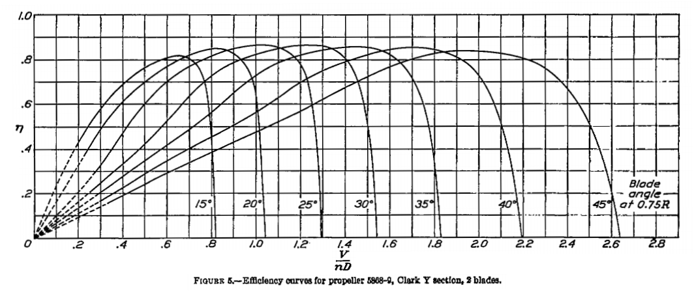
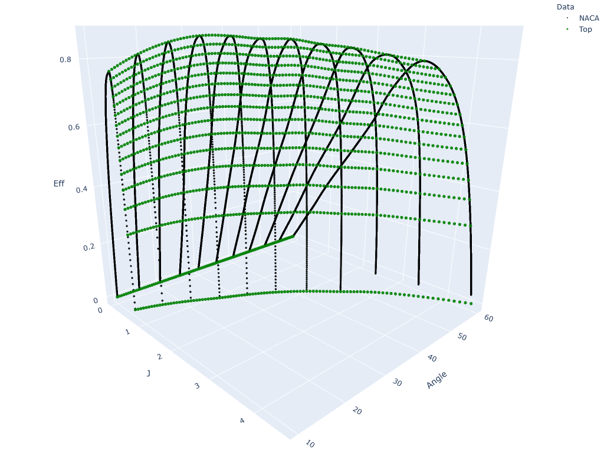

# Propeller Chart Meshing Toolkit
Tools used to create fine meshes used by the [Prop Calculator](https://propellers.herokuapp.com/) based on propeller test data.

## Introduction
One of the steps in aircraft design process is calculating the performance figures. 
*Max power, max airspeed* and *max service ceiling* are the most prominent examples. 
In order to calculate them we need to know the engine power and the propeller's **Coefficient of Efficiency *&eta;***. 
An example *&eta;* chart for a 2 bladed prop can be seen below:

Where:
  - **V** - Aircraft speed
  - **n** - Propeller speed
  - ***D*** - Propeller diameter

And  - Advance Ratio - a dimensionless velocity describing the flow around the propeller blade

Designing an aircraft powertrain can be a tedious process when done manually. 
The designer is required to interpolate the data from the chart based on initial conditions in order to calculate the &eta;.
When the user chooses one of the angles from the chart the process is straightforward.
Otherwise the interpolation becomes very time consuming and the precision of the results may be questioned.
The whole process could easily be automated but ***the data needed to be processed*** first.
That led to the birth of this toolkit.

## Built With
* [Python](https://www.python.org/)
* [NumPy](https://numpy.org/) - This is the fundamental package for scientific computing with Python
* [pandas](https://pandas.pydata.org/) - This is a fast and easy to use data analysis and manipulation tool
* [SciPy](http://scipy.org/) - This is a Python library used for scientific and technical computing
* [Plotly](http://plotly.com/) - This Python graphing library makes interactive, publication-quality graphs

## Data sources
The application is based on two reports published in 1938 and 1939 respectively by the NASA predecessor - National Advisory Committee for Aeronautics:
  * [NACA 640](http://naca.central.cranfield.ac.uk/reports/1938/naca-report-640.pdf) - 
  Tests of propellers having 2, 3 and 4 blades of different airfoils at blade angles up to 45°.
  * [NACA 658](http://naca.central.cranfield.ac.uk/reports/1939/naca-report-658.pdf) - Tests of two propellers at blade angles up to 60°.

The higher blade angles are intended for high-speed aircraft. 
The latter of the reports has data only for propellers with 3 or 4 blades. 
This is a problem as it limits the configurations the designer can use.

## Data preparation
The first step in exploring the data further is ***making it 3D***.
A new axis was assigned to the Angle parameter. 
The result can be seen below with the other blade numbers thrown in for good measure.

Every propeller type has different &eta; characteristics. 
As you can see the 4 bladed prop is the only one having data up to 60° of Angle.
The remaining data was approximated using ***polynomial regression***.

### Approximating the unknown
This process can be described in a few simple steps:
  1. Calculate &eta; ratios for a given pair of propellers (n- and 4-bladed).
  2. Normalize them and fit a polynomial.
  3. Use this polynomial to calculate unknown ratios for angles greater than 45°.
  4. Calculate approximated curves from the 4 bladed prop data and newly obtained ratios.

Normalized &eta; ratios for a 2 bladed propeller.
A 9th degree polynomial was chosen as it had the best fit to the underlying data.

As you can see the generated data **fit very well with the test curves**.
The expanded data was then used as a basis for the mesh densing algorithm. 

### Series interpolation

## Results

