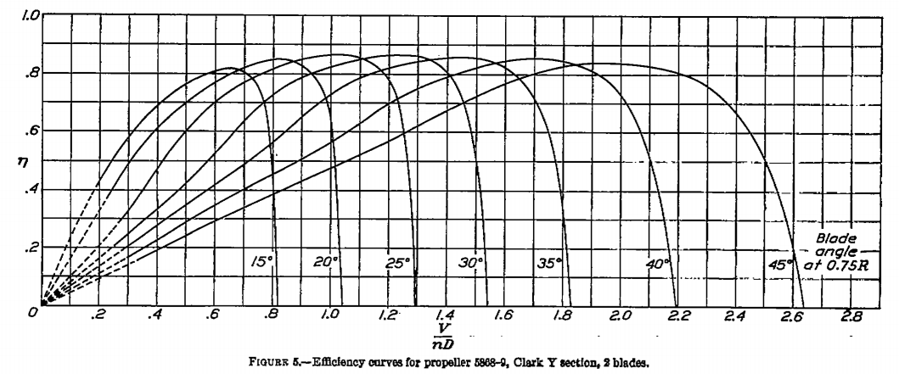
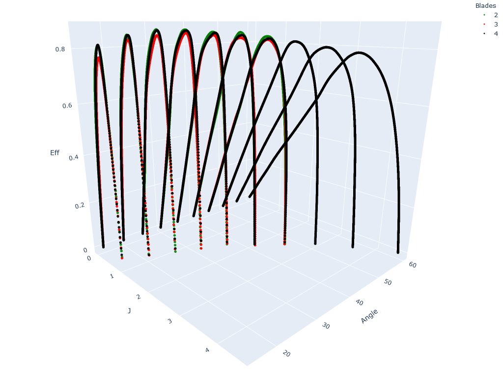
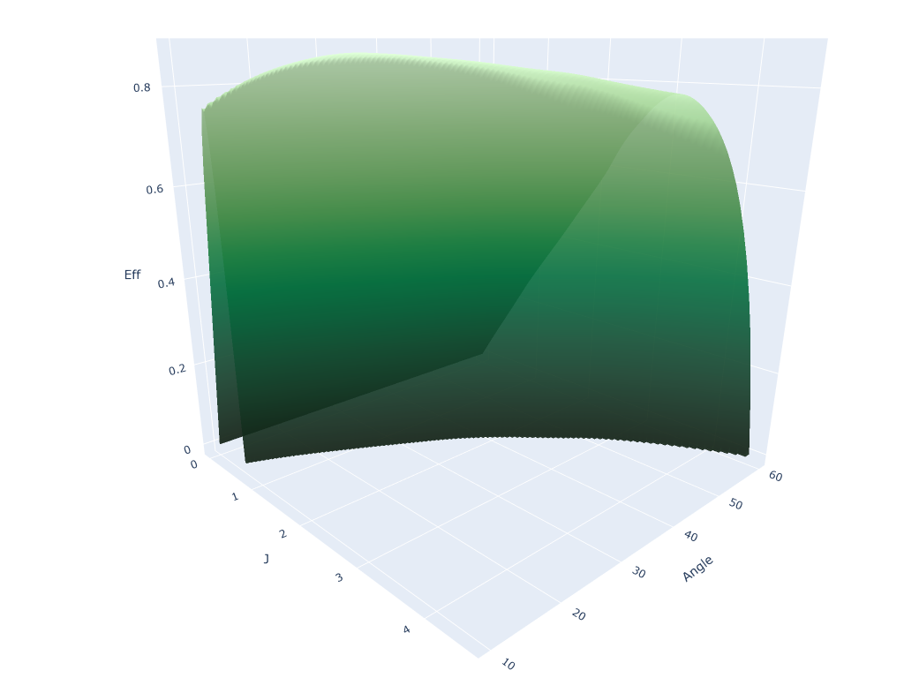

# Propeller Chart Meshing Toolkit
Tools used to create fine meshes used by the [Prop Calculator](https://propellers.herokuapp.com/) based on propeller test data.

## Introduction
One of the steps in aircraft design process is calculating the performance figures. 
*Max power, max airspeed* and *max service ceiling* are the most prominent examples. 
In order to calculate them we need to know the engine power and the propeller's **Coefficient of Efficiency *&eta;***. 
An example *&eta;* chart can be seen below:

Where:
  - ***V*** - Aircraft speed
  - ***n*** - Propeller speed
  - ***D*** - Propeller diameter
   
And $\mathbf{J=\frac{V}{nD}}$ - Advance ratio

Designing an aircraft powertrain can be a tedious process when done manually. 
The designer is required to interpolate the data from the chart based on initial conditions in order to calculate the &eta;.
When the user chooses one of the angles from the chart the process is straightforward.
Otherwise the interpolation becomes very time consuming and the precision of the results may be questioned.
The whole process could easily be automated but ***the data needed to be processed*** first.
That led to the birth of this toolkit.

## Data sources
The application is based on two reports published in 1938 and 1939 respectively by the NASA predecessor - National Advisory Committee for Aeronautics:
  * [NACA 640](http://naca.central.cranfield.ac.uk/reports/1938/naca-report-640.pdf) - 
  Tests of propellers having 2, 3 and 4 blades of different airfoils at blade angles up to 45°.
  * [NACA 658](http://naca.central.cranfield.ac.uk/reports/1939/naca-report-658.pdf) - Tests of two propellers at blade angles up to 60°.

The higher blade angles are intended for high-speed aircraft. 
The latter of the reports has data only for propellers with 3 or 4 blades. 
The remaining data was approximated using ***polynomial regression***.

## Data preparation

### Curve fitting

### Series interpolation

## Results

